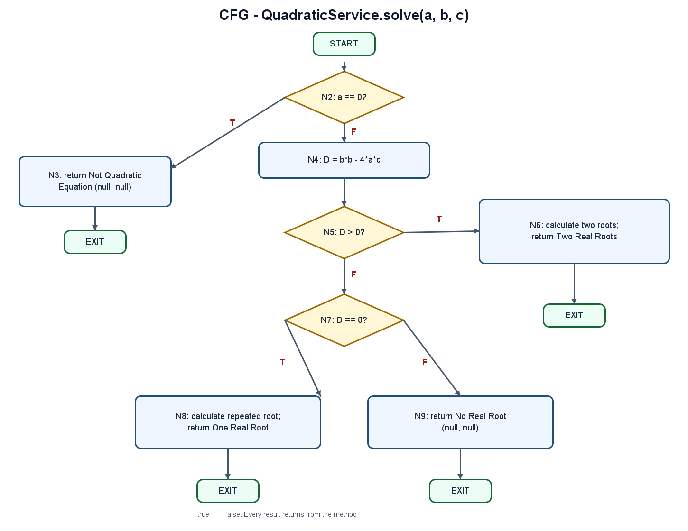

# Quadratic Equation Path Testing

## Project description

This Maven/Spring Boot application solves a quadratic equation and demonstrates white-box path testing of its service logic. It classifies the equation based on its leading coefficient and discriminant, and returns a status with up to two real roots.

## Technologies

- Java 17
- Spring Boot 3.4.5 and Spring Web
- Maven
- JUnit 5 and Spring Boot Test (including Mockito)

## Source analysis

The method under test is `QuadraticService.solve(double a, double b, double c)`. Its ordered decisions are:

1. If `a == 0`, return `Not Quadratic Equation` without calculating the discriminant.
2. Calculate `D = b*b - 4*a*c`.
3. If `D > 0`, calculate and return both roots with status `Two Real Roots`.
4. If `D == 0`, calculate and return the repeated root with status `One Real Root`.
5. Otherwise return `No Real Root`.

`QuadraticController` exposes this logic at `GET /quadratic/solve?a=...&b=...&c=...`. The JSON response has `status`, `root1`, and `root2` properties; roots not applicable to the result are `null`. `QuadraticServiceTest` directly tests the service's four outcomes and asserts numerical roots with a tolerance of `1.0e-9`.

## Control-flow graph (CFG)

The graph models only `QuadraticService.solve`, with one entry and the method's return paths leading to exit. Its node and decision definitions are described in [docs/path-testing.md](docs/path-testing.md).

## Cyclomatic complexity

The method has three binary decisions: `a == 0`, `D > 0`, and `D == 0`.

**V(G) = Decision + 1 = 3 + 1 = 4**

Therefore, four independent basis paths are required. The complete path traversal table and test case mapping are in [docs/path-testing.md](docs/path-testing.md).

## Independent paths

| Path | Node Traversal | Condition | Expected Output |
|---|---|---|---|
| P1 | Start → N2(T) → N3 → Exit | `a == 0` | Not Quadratic Equation; roots null |
| P2 | Start → N2(F) → N4 → N5(T) → N6 → Exit | `a != 0`, `D > 0` | Two Real Roots with both roots calculated |
| P3 | Start → N2(F) → N4 → N5(F) → N7(T) → N8 → Exit | `a != 0`, `D == 0` | One Real Root; second root null |
| P4 | Start → N2(F) → N4 → N5(F) → N7(F) → N9 → Exit | `a != 0`, `D < 0` | No Real Root; roots null |

## Test case table

| TC | Input `(a, b, c)` | Expected Result |
|---|---|---|
| TC1 / P1 | `(0, 2, 1)` | `Not Quadratic Equation`; `root1=null`, `root2=null` |
| TC2 / P2 | `(1, -3, 2)` | `Two Real Roots`; `root1=2`, `root2=1` |
| TC3 / P3 | `(1, 2, 1)` | `One Real Root`; `root1=-1`, `root2=null` |
| TC4 / P4 | `(1, 0, 1)` | `No Real Root`; `root1=null`, `root2=null` |

## Statement coverage

Scope: the body of `QuadraticService.solve` only. Count source-level executable statements including `if` control statements, declarations/calculations, and returns. Exclude the signature, braces, comments, and blank lines. This yields a denominator of **12 statements**. The four tests collectively exercise all 12: **statement coverage = 12/12 = 100%**.

## Branch coverage

Scope: the three binary decisions in `QuadraticService.solve`. Count true and false outcomes for each decision, for **3 × 2 = 6 branches**. TC1 covers true and the other tests cover false for `a == 0`; TC2 covers true and TC3/TC4 cover false for `D > 0`; TC3 covers true and TC4 false for `D == 0`. Thus **branch coverage = 6/6 = 100%**.

The detailed statement-by-statement and decision-outcome coverage tables are in [docs/coverage-analysis.md](docs/coverage-analysis.md).

## Conclusion

The four JUnit test cases cover the four independent paths derived from `V(G) = 4`, all 12 counted executable statements, and all six decision outcomes. Root assertions use a floating-point tolerance, and unused roots are checked as null.
